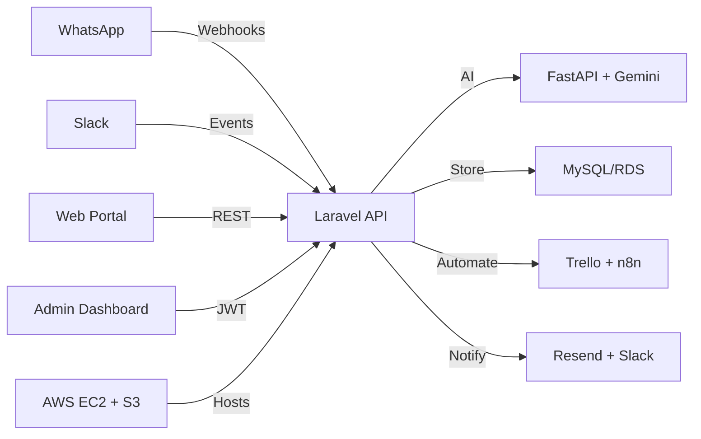

<div align="center">
  

  <br/>

  [](https://git.io/typing-svg)

  <br/><br/>

  <p align="center">
    <a href="https://github.com/syedammarhaider">
      
    </a>
    <a href="https://github.com/syedammarhaider?tab=followers">
      
    </a>
    <a href="https://github.com/syedammarhaider">
      
    </a>
  </p>

  <p align="center">
    
    
  </p>
</div>

---

## 🧑‍💻 About Me

```yaml
👤 Name     : Syed Ammar Haider
📍 Location : Faisalabad, Pakistan 🇵🇰
💼 Role     : Full Stack Developer & AI Engineer
🏢 Company  : DS Technologies Pvt Ltd (Intern)
🎯 Focus    : AI Systems · SaaS · Cloud · UI/UX
🛠️ Stack    : Laravel · FastAPI · Tailwind · React
🤖 AI Tech  : LangChain · LLM · Agentic AI
🔬 Research : Published Author on ResearchGate
✨ Status   : Open to Opportunities
```

---

## 🚀 Featured Project — ARIA (AI Agent SaaS Platform)

> **Multi-channel AI agent** — WhatsApp · Slack · Web Portal — built for 24/7 autonomous client engagement.

| Layer | Tech |
|---|---|
| **Frontend** | React + Tailwind CSS (real-time admin dashboard) |
| **Backend** | Laravel REST API · MySQL · Sanctum JWT |
| **AI Service** | FastAPI · LangChain · Google Gemini |
| **Automation** | Trello · Resend Email · Slack Alerts · n8n |
| **Cloud** | AWS EC2 · S3 · RDS |

**Key achievements:** `<10s AI response` · `<3s webhook sync` · `16 validated test cases` · `100% automated project intake`



---

## 🛒 VendoMart — Smart E-Commerce Platform

> Full-featured marketplace with AI-assisted product discovery, multi-role dashboards, and AWS deployment.


- Product catalog, smart cart, secure checkout, order tracking
- AI-powered search & personalized recommendations
- Role-based access: Admin · Seller · Buyer
- PDF invoice generation, integrated payment gateway

---

## 📝 BlogSphere — Content Publishing Platform

> Full-stack blog system with SEO optimization, rich text editor, and social engagement features.


- Rich text editor with image upload, tags, draft/publish system
- SEO meta tags, sitemap, Open Graph, search-friendly URLs
- Comment system, likes, author profiles, follow mechanism
- JWT auth, role management (Admin / Author), analytics dashboard

---

## 🕷️ AI Web Scraper — FastAPI Intelligence Engine

> Autonomous data extraction with a conversational AI interface, deployed on AWS EC2.


- Structured & unstructured data extraction (CSS selectors + Selenium)
- Gemini-powered conversational interface for natural language queries
- Export to JSON, CSV, Excel, PDF, plain text
- Async processing, rate limiting, session persistence

---

## 💼 Internship — DS Technologies Pvt Ltd

**`January 2026 — Present`** | Full Stack · AI Engineering · Cloud · QA

| Timeline | Focus | Highlights |
|---|---|---|
| **Apr 2026** | 🤖 ARIA AI SaaS | Multi-channel AI agent, React dashboard, AWS deployment, 16 test cases |
| **Mar 2026** | ☁️ AWS + Full-Stack | EC2/S3/RDS mastery, Groq API, n8n automation, client management system |
| **Feb 2026** | 🕷️ AI Web Scraper | FastAPI + Gemini, AWS EC2 deploy, multi-format export, Selenium |
| **Jan 2026** | 🏗️ Foundation | Portfolio site, Laravel Todo App, AWS fundamentals, Git workflows |

> *"Strong progress… technical versatility across AI integration, backend, frontend, and workflow automation. Strong persistence, resilience, and technical dedication."*
> — **DS Technologies Technical Review Team**

<p align="center">
  
  
  
</p>

---

## 💻 Technology Arsenal

**Frontend**


**Backend**


**AI & Automation**


**Database & Cloud**


**APIs & Tools**


---

## 📊 GitHub Stats

<div align="center">

<table>
<tr>
<td>

</td>
<td>

</td>
</tr>
</table>

[](https://git.io/streak-stats)

[](https://github.com/ashutosh00710/github-readme-activity-graph)

[](https://github.com/ryo-ma/github-profile-trophy)

</div>

---

## 🎯 Let's Connect

<div align="center">

<a href="https://www.linkedin.com/in/syed-ammar-haider-61136b27b/">
  
</a>&nbsp;
<a href="mailto:syedammar496539@gmail.com">
  
</a>&nbsp;
<a href="https://github.com/syedammarhaider">
  
</a>&nbsp;
<a href="https://www.youtube.com/@ourlifeourules">
  
</a>&nbsp;
<a href="https://www.researchgate.net/">
  
</a>

<br/><br/>

<picture>
  <source media="(prefers-color-scheme: dark)" srcset="https://raw.githubusercontent.com/platane/snk/output/github-contribution-grid-snake-dark.svg"/>
  <source media="(prefers-color-scheme: light)" srcset="https://raw.githubusercontent.com/platane/snk/output/github-contribution-grid-snake.svg"/>
  
</picture>

<br/>


**⭐ If you find my work valuable, consider starring my repositories!**

*"The best code solves real problems elegantly — and the best engineer never stops learning."* 💡

</div>
