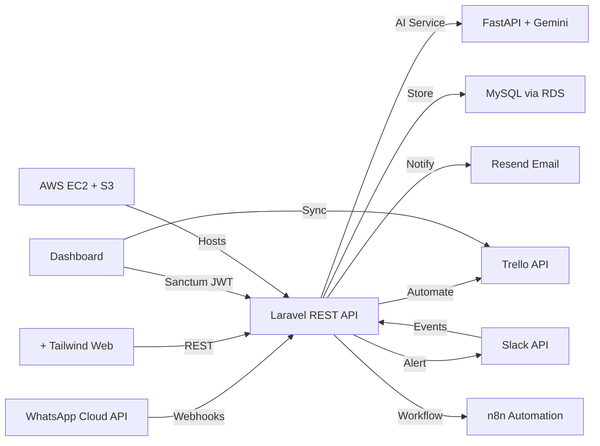

<div align="center">
  
  
  <br/>
  
  [](https://git.io/typing-svg)
  
  <br/><br/>
  
  <p align="center">
    <a href="https://github.com/syedammarhaider">
      
    </a>
    <a href="https://github.com/syedammarhaider?tab=followers">
      
    </a>
    <a href="https://github.com/syedammarhaider">
      
    </a>
  </p>
  
  <p align="center">
    
    
  </p>
</div>

---
<br/>

<table width="100%">
<tr>
<td width="50%" valign="top">


<br/>

## 🧑‍💻 About Me
```yaml
👤 Name     : Syed Ammar Haider
📍 Location : Faisalabad, Pakistan 🇵🇰
💼 Role     : Full Stack Developer & AI Engineer
🏢 Company  : DS Technologies Pvt Ltd (Intern)
🎯 Focus    : AI Systems · SaaS · Cloud · UI/UX
🛠️ Stack    : Laravel · FastAPI · Tailwind · React
🤖 AI Tech  : LangChain · LLM · Agentic AI
🔬 Research : Published Author on ResearchGate
✨ Status   : Open to Opportunities

### 🎨 Key Features & Accomplishments

<table width="100%">
<tr>
<td width="33%" valign="top" align="center">

####  Multi-Channel AI Agent

**Architected a LangChain-based conversational AI** powered by Google Gemini, seamlessly integrated across three simultaneous channels — WhatsApp (Meta Cloud API), Slack, and a + Tailwind CSS web portal — enabling **24/7 autonomous client engagement** with intelligent context retention.


</td>
<td width="33%" valign="top" align="center">

####  Intelligent Conversation Flow

**Engineered structured multi-turn requirement gathering** conversations to intelligently collect project specifications including type, features, timeline, and budget through natural dialogue — transforming unstructured client input into actionable data, persisted via **Laravel Eloquent ORM into MySQL**.


</td>
<td width="33%" valign="top" align="center">

####  Workflow Automation

**Automated the complete post-confirmation workflow**: Trello card creation, professional HTML email notifications via Resend API, Slack team alerts, and **n8n automation pipelines** — eliminating manual project intake entirely and reducing response time from hours to seconds.


</td>
</tr>
</table>

<br/>

<table width="100%">
<tr>
<td width="50%" valign="top" align="center">

####  Admin Dashboard

**Built a + Tailwind CSS administrative dashboard** with real-time CRUD visibility, analytics, activity monitoring, and **bidirectional Trello synchronization**. Backend is a **Laravel REST API** with MySQL persistence. Automated client email notifications trigger on every status change — providing complete project transparency.

<br/>
<p align="center">
  
  
  
</p>

</td>
<td width="50%" valign="top" align="center">

####  High-Performance Backend

**Developed the backend on Laravel (PHP)** with MySQL for full data persistence and **Laravel Sanctum JWT authentication**. AI services run on a separate **FastAPI (Python) microservice** integrated with Google Gemini. Deployed on **AWS EC2** with S3 + RDS, achieving **AI response under 10 seconds** and **webhook sync within 3 seconds** across **16 validated test cases**.

<br/>
<p align="center">
  
  
  
</p>

</td>
</tr>
</table>

<br/>

<div align="center">

### 🏗️ System Architecture



### 📊 Integration Flow

```ascii
┌─────────────────────────────────────────────────────────────────────────────┐
│                        Client Interaction Layer                             │
│  ┌──────────────┐    ┌──────────────┐    ┌──────────────────────────────┐  │
│  │  WhatsApp    │    │    Slack     │    │   PHP + Tailwind CSS       │  │
│  │  Messages    │    │  Messages   │    │   Web Portal (SPA)           │  │
│  └──────┬───────┘    └──────┬───────┘    └─────────────┬────────────────┘  │
└─────────┼───────────────────┼───────────────────────── ┼────────────────────┘
          │                   │                          │
          └───────────────────┼──────────────────────────┘
                              ▼
┌─────────────────────────────────────────────────────────────────────────────┐
│               AI Processing & Orchestration (AWS EC2)                       │
│  ┌───────────────────────────────────────────────────────────────────────┐  │
│  │      Laravel (PHP) REST API · MySQL · Sanctum JWT Auth               │  │
│  │           + FastAPI (Python) · LangChain · Google Gemini             │  │
│  │  • Multi-turn Conversation Management · MySQL Storage                │  │
│  │  • Context-aware Requirement Extraction                              │  │
│  │  • Intelligent Response Generation via Gemini                        │  │
│  └──────────────────────────┬────────────────────────────────────────────┘  │
└─────────────────────────────┼───────────────────────────────────────────────┘
                              ▼
┌─────────────────────────────────────────────────────────────────────────────┐
│                      Automated Workflow Actions                             │
│  ┌─────────────┐  ┌─────────────┐  ┌─────────────┐  ┌──────────────────┐  │
│  │Create Trello│  │ Send HTML   │  │ Slack Team  │  │ MySQL · AWS RDS  │  │
│  │   Cards     │  │   Emails    │  │   Alerts    │  │  Data Storage    │  │
│  └─────────────┘  └─────────────┘  └─────────────┘  └──────────────────┘  │
└─────────────────────────────────────────────────────────────────────────────┘
```


</div>

<br/>

---

<br/>

<div align="center">

## 🛒 VendoMart — Smart E-Commerce Platform

### *Full-Featured Online Marketplace with AI-Assisted Product Discovery*

&nbsp;


<br/><br/>


</div>

<br/>

<table width="100%">
<tr>
<td width="60%" valign="top">

### 🎯 Core Features

```yaml
🛍️ E-Commerce Essentials:
   • Product Catalog & Listings
   • Smart Shopping Cart
   • Secure Checkout Flow
   • Order Tracking System
   • Multi-role Seller Dashboard

🔍 AI-Powered Discovery:
   • Intelligent Recommendations
   • Natural Language Search
   • Personalized Suggestions

💳 Payment & Management:
   • Integrated Payment Gateway
   • Automated Invoice Generation
   • PDF Invoice Export
   • Role-Based Access Control

🎨 User Experience:
   • Fully Responsive (Tailwind CSS)
   • Smooth Animations
   • Mobile-First Design
   • Intuitive Navigation
```

</td>
<td width="40%" valign="top">

### 🛠️ Technology Stack

```yaml
Frontend:
   • React.js (SPA)
   • Tailwind CSS
   • JavaScript (ES6+)
   • HTML5 / CSS3

Backend:
   • Laravel (PHP)
   • RESTful API
   • Laravel Sanctum Auth
   • Eloquent ORM

Database & Cloud:
   • MySQL (relational DB)
   • AWS EC2 (hosting)
   • AWS S3 (media/assets)
   • AWS RDS (managed DB)
```

### 👥 User Roles

<p align="center">
  
  
  
</p>

</td>
</tr>
</table>

<br/>

---

<br/>

<div align="center">

## 📝 BlogSphere — Modern Content Publishing Platform

### *Full-Stack Blog System with SEO & Social Engagement*

&nbsp;


<br/><br/>


</div>

<br/>

<table width="100%">
<tr>
<td width="50%" valign="top">

### ✨ Publishing Features

```yaml
✍️ Rich Content Editor:
   • Advanced Text Editor
   • Image Upload & Management
   • Tags & Categories
   • Draft & Publish System

🔍 SEO & Discovery:
   • Meta Tag Optimization
   • Automatic Sitemap
   • Open Graph Support
   • Search-Friendly URLs

💬 Social Engagement:
   • Comment System
   • Like & Share Features
   • Author Profiles
   • Follow Mechanism
```

</td>
<td width="50%" valign="top">

### 📊 Analytics & Management

```yaml
📈 Content Analytics:
   • Post View Tracking
   • Engagement Metrics
   • Popular Posts
   • Author Dashboard

🔐 Authentication & Roles:
   • JWT-Based Security
   • Role Management (Admin/Author)
   • Admin Panel
   • Author Controls

🎨 User Experience:
   • Responsive Design (Tailwind)
   • Reading Time Estimate
   • Related Posts
   • Social Share Buttons
```

</td>
</tr>
</table>

<br/>

---

<br/>

<div align="center">

## 🕷️ AI Web Scraper — FastAPI Intelligence Engine

### *Autonomous Data Extraction with Conversational AI Interface*

&nbsp;


<br/><br/>


</div>

<br/>

<table width="100%">
<tr>
<td width="55%" valign="top">

### ⚡ Scraping Capabilities

```yaml
🔍 Data Extraction:
   • Structured Data (Tables, Lists)
   • Unstructured Content (Text, Articles)
   • Product Info (Titles, Prices, Images)
   • Media Assets (Images, Links)
   • Custom CSS Selectors
   • Dynamic Content (Selenium)

🤖 AI Chat Interface:
   • Gemini-Powered Conversations
   • Context-Aware Queries
   • Intelligent Data Filtering
   • Natural Language Commands
   • Dual-Mode AI (auto model select)

📤 Export Formats:
   • JSON · CSV · Excel · PDF · Text
```

</td>
<td width="45%" valign="top">

### 🏗️ Infrastructure

```yaml
☁️ Cloud Deployment:
   • AWS EC2 — production server
   • Secure env config & IAM
   • Optimized for high availability

⚙️ Backend Architecture:
   • FastAPI (Python) framework
   • Async request processing
   • Rate limiting & error handling
   • Session & data persistence

🔧 Data Processing:
   • BeautifulSoup — HTML parsing
   • Selenium — dynamic sites
   • Data validation & formatting
   • Multi-format export engine
```

</td>
</tr>
</table>

<br/>

---

<br/>

<div align="center">

## 🌐 Personal Portfolio Website

### *Responsive Developer Portfolio with Interactive UI & Smooth Animations*

&nbsp;


<br/><br/>


</div>

<br/>

<table width="100%">
<tr>
<td width="50%" valign="top">

### ✨ Features

```yaml
🎨 Design & UI:
   • Fully Responsive (mobile-first)
   • Smooth CSS scroll animations
   • Interactive project showcase
   • Modern glassmorphism UI
   • CSS keyframe animations

📌 Sections:
   • Hero with animated intro
   • Skills & Technology Arsenal
   • Projects with live demos
   • Internship experience timeline
   • Contact form with validation
```

</td>
<td width="50%" valign="top">

### 🛠️ Built With

```yaml
Structure & Style:
   • HTML5 — semantic markup
   • CSS3 — animations & layout
   • JavaScript — DOM interactions
   • Mobile-first responsive grid

Deployment:
   • AWS EC2 — live hosting
   • GitHub — version control
   • Optimized assets & performance

Design Principles:
   • UI/UX best practices
   • Visual hierarchy
   • Accessibility standards
```

</td>
</tr>
</table>

<br/>

---

<br/>

<div align="center">

## ✅ Todo App — Laravel CRUD Application

### *Full-Stack Task Manager with MVC Architecture*


<br/><br/>


</div>

<br/>

<table width="100%">
<tr>
<td width="50%" valign="top">

### 🎯 Features

```yaml
📋 Task Management:
   • Create, Read, Update, Delete tasks
   • Task status tracking
   • Priority levels
   • Due dates & reminders
   • User-friendly responsive UI

🔐 Authentication:
   • Laravel Breeze auth
   • Session-based login/logout
   • Per-user task isolation
```

</td>
<td width="50%" valign="top">

### 🛠️ Tech Stack

```yaml
Backend:
   • Laravel (PHP) — MVC pattern
   • Eloquent ORM — DB operations
   • Blade templating engine
   • Laravel routing & middleware

Database:
   • MySQL — relational storage
   • Migrations & seeders
   • Optimized CRUD queries

Frontend:
   • Tailwind CSS — styling
   • JavaScript — interactivity
   • HTML5 / CSS3
```

</td>
</tr>
</table>

<br/>

---

<br/>

<div align="center">

# 💼 Internship Journey


## 🏢 DS Technologies Pvt Ltd — Software Engineer Intern

**`January 2026 — Present`** • *Full Stack Development · AI Engineering · Cloud Architecture · Quality Assurance*

</div>

<br/>

<table width="100%">
<thead>
<tr>
<th width="15%" align="center">Timeline</th>
<th width="25%" align="center">Focus Area</th>
<th width="60%" align="left">Key Deliverables & Achievements</th>
</tr>
</thead>
<tbody>
<tr>
<td align="center"></td>
<td align="center"><b>🤖 AI Agent SaaS Platform</b></td>
<td>
• Launched <b>ARIA</b> — production-ready multi-channel AI agent (WhatsApp, Slack, Web)<br/>
• Built <b>Laravel (PHP)</b> REST API backend with MySQL and Sanctum JWT authentication<br/>
• Built <b>React + Tailwind CSS</b> real-time admin dashboard with analytics & CRUD<br/>
• Integrated <b>FastAPI (Python)</b> AI microservice — LangChain + Gemini<br/>
• Automated Trello cards, HTML emails (Resend), Slack alerts via <b>n8n workflows</b><br/>
• Deployed on <b>AWS EC2</b> with S3 storage and RDS managed database<br/>
• Achieved &lt;10s AI response times, &lt;3s webhook sync across 16 validated test cases<br/>
• Performed comprehensive QA, functional testing, and API validation
</td>
</tr>
<tr>
<td align="center"></td>
<td align="center"><b>☁️ AWS & Full-Stack Platform</b></td>
<td>
• Mastered AWS — EC2, S3, RDS, IAM — with secure scalable deployment<br/>
• Advanced JavaScript: async/await, closures, API integration, event handling, performance<br/>
• Built production full-stack platform using <b>Laravel backend + React frontend</b><br/>
• Integrated <b>Groq API</b> for real-time AI conversation module with MySQL storage<br/>
• Complete client management system with CRUD, billing, PDF invoices<br/>
• Integrated <b>n8n</b> for automated workflows (AI tasks, billing, client updates)<br/>
• Multi-channel communication system (WhatsApp, Slack, Email) via AI agent
</td>
</tr>
<tr>
<td align="center"></td>
<td align="center"><b>🕷️ AI Web Scraper</b></td>
<td>
• Developed <b>FastAPI (Python)</b> AI-powered web scraper with conversational chatbot<br/>
• Integrated <b>Google Gemini</b> for context-aware, data-driven AI responses<br/>
• Deployed to <b>AWS EC2</b> — production-grade server & API configuration<br/>
• Multi-format export: JSON, CSV, Excel, PDF, plain text<br/>
• CSS selector support + <b>Selenium</b>-powered dynamic content handling<br/>
• Enhanced frontend with advanced <b>JavaScript</b> and responsive HTML/CSS<br/>
• Resolved complex data persistence, auth, and AWS EC2 configuration issues<br/>
• Applied comprehensive error handling, fallbacks, and fail-safe mechanisms
</td>
</tr>
<tr>
<td align="center"></td>
<td align="center"><b>🏗️ Foundation & Portfolio</b></td>
<td>
• Built <b>fully responsive personal portfolio</b> with HTML, CSS, JavaScript and smooth animations<br/>
• Created <b>Laravel + MySQL Todo App</b> with complete CRUD, MVC architecture, Tailwind CSS<br/>
• Applied core <b>PHP & Laravel</b> concepts: routes, controllers, Eloquent, Blade, middleware<br/>
• Learned <b>AWS fundamentals</b>: EC2, IAM, S3, RDS, CloudWatch — deployed to cloud<br/>
• Mastered Git workflows, GitHub collaboration, deployment pipelines<br/>
• Established MVC coding standards, mobile-first design, and best practices
</td>
</tr>
</tbody>
</table>

<br/>

<div align="center">

### 💬 Performance Review

> *"Syed Ammar Haider has demonstrated **strong progress** by developing a comprehensive AI-powered SaaS platform. The project showcases **technical versatility** across multiple domains — AI integration, backend architecture, frontend development, and workflow automation. His work reflects **strong persistence, resilience, and technical dedication**."*
>
> — **DS Technologies Technical Review Team**

<br/>


</div>

<br/>

---

<br/>

<div align="center">

# 💻 Technology Arsenal


</div>

<br/>

### 🎨 Frontend Development

<p align="center">
  
  
  
  
  
  
  
</p>

### ⚙️ Backend Development

<p align="center">
  
  
  
  
  
  
</p>

### 🤖 AI & Automation

<p align="center">
  
  
  
  
  
  
  
</p>

### 🗄️ Databases

<p align="center">
  
  
  
</p>

### ☁️ Cloud & DevOps

<p align="center">
  
  
  
  
  
  
</p>

### 🔌 API Integrations

<p align="center">
  
  
  
  
  
  
</p>

### 🎨 Design & Collaboration

<p align="center">
  
  
  
  
  
</p>

<br/>

---

<br/>

<div align="center">

# 📊 GitHub Performance Analytics


<br/><br/>

<table width="100%">
<tr>
<td width="50%" align="center">

</td>
<td width="50%" align="center">

</td>
</tr>
</table>

<br/>

[](https://git.io/streak-stats)

<br/>

### 📈 Contribution Graph

[](https://github.com/ashutosh00710/github-readme-activity-graph)

</div>

<br/>

---

<br/>

<div align="center">

# 🏆 Achievements & Recognition


<br/><br/>

[](https://github.com/ryo-ma/github-profile-trophy)

<br/>

### 🔝 Top Repositories

[](https://github.com/syedammarhaider)

</div>

<br/>

---

<br/>

<div align="center">

# 💭 Developer Inspiration


<br/><br/>


</div>

<br/>

---

<br/>

<div align="center">

# 🎯 Let's Build Something Amazing Together!


<br/><br/>

<table>
<tr>
<td align="center" width="33%">

### 🤝 Collaboration

Open to exciting projects,<br/>
freelance opportunities,<br/>
and innovative ideas!

<br/>


</td>
<td align="center" width="33%">

### 💼 Opportunities

Looking for full-time roles in:<br/>
• Full Stack Development<br/>
• AI Engineering<br/>
• Cloud Architecture

<br/>


</td>
<td align="center" width="33%">

### 📬 Get In Touch

Drop me a message and<br/>
let's discuss how we can<br/>
turn ideas into reality!

<br/>

<a href="mailto:syedammar496539@gmail.com">
  
</a>

</td>
</tr>
</table>

<br/>


<br/>

### 📫 Connect Across Platforms

<a href="https://www.linkedin.com/in/syed-ammar-haider-61136b27b/">
  
</a>&nbsp;&nbsp;
<a href="mailto:syedammar496539@gmail.com">
  
</a>&nbsp;&nbsp;
<a href="https://github.com/syedammarhaider">
  
</a>&nbsp;&nbsp;
<a href="https://www.youtube.com/@ourlifeourules">
  
</a>&nbsp;&nbsp;
<a href="https://www.researchgate.net/">
  
</a>

<br/><br/>

<picture>
  <source media="(prefers-color-scheme: dark)" srcset="https://raw.githubusercontent.com/platane/snk/output/github-contribution-grid-snake-dark.svg"/>
  <source media="(prefers-color-scheme: light)" srcset="https://raw.githubusercontent.com/platane/snk/output/github-contribution-grid-snake.svg"/>
  
</picture>

<br/><br/>


<br/>


<br/>

**⭐ If you find my work valuable, consider starring my repositories — it means the world to me!**

<br/>

*"The best code is the one that solves real problems elegantly — and the best engineer is one who never stops learning."* 💡

<br/>


</div>
